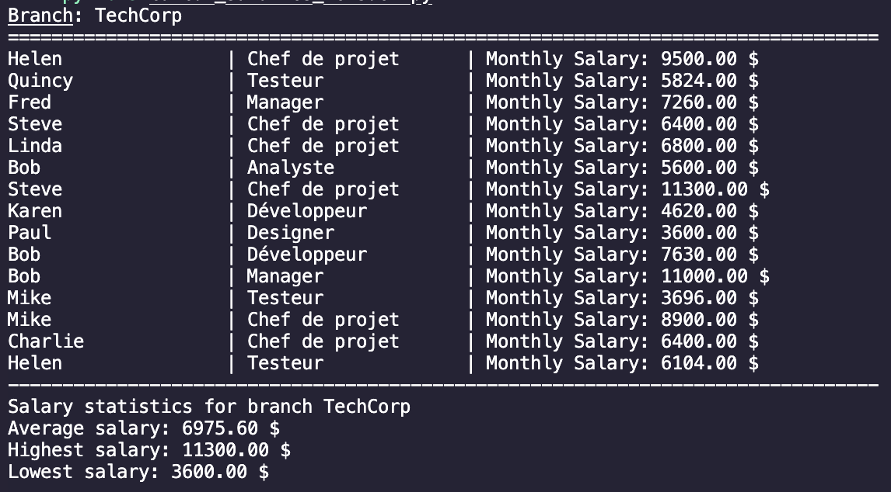
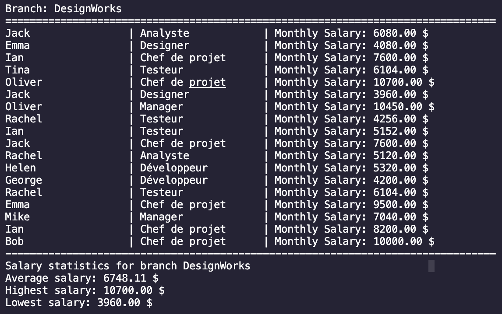
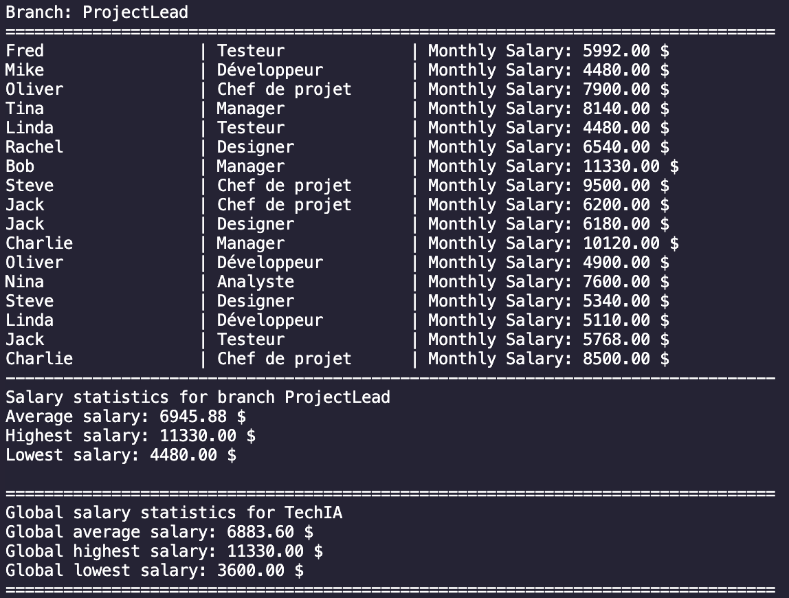

# Simplon-TechIA-Salary-Manager

### Overview

**TechIA-Salary-Manager** is a Python-based application that processes employee data from a JSON file, calculates monthly salaries, and generates a detailed report for each branch (filiale). The script also adds a new `monthly_salary` key to each employee's data, storing the result in an updated JSON file.

### Features

- Extracts employee data from a JSON file.
- Calculates monthly salaries, considering contract hours and overtime.
- Outputs detailed salary reports for each branch.
- Computes and displays salary statistics (average, highest, lowest) per branch and globally.
- Adds calculated monthly salaries to the original data and saves them in an updated JSON file.

### Functions

- extract_data(): Extracts and organizes employee data by branch.
- calcul_single_monthly_rate(hourly_rate, weekly_hours_worked, contract_hours): Calculates the monthly salary for an employee.
- calcul_stats(salary_list): Computes the mean, maximum, and minimum salary from a list of salaries.

### Report Preview

